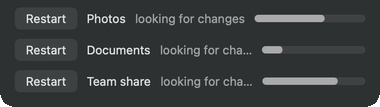
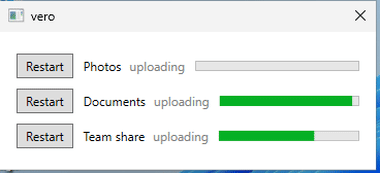
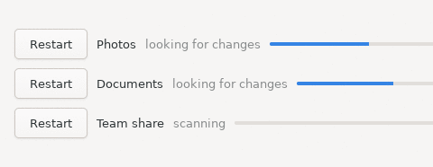

# vero

**A Go backend with native macOS, Windows and Linux frontends. All built on macOS.**

[Quickstart on macOS](#quickstart-on-macos) ·
[The go worker](#the-go-worker) ·
[macOS](#macos-add-vero-to-your-own-macos-app) ·
[Windows](#windows-add-the-same-worker-to-a-windows-app) ·
[Linux](#linux-add-the-same-worker-to-a-linux-app) ·
[Run the examples](#run-the-examples)

<table>
<tr>
<td align="center" width="33%"><a href="#macos-add-vero-to-your-own-macos-app"></a><br><sub><b>macOS</b> — SwiftUI, in the menu bar</sub></td>
<td align="center" width="33%"><a href="#windows-add-the-same-worker-to-a-windows-app"></a><br><sub><b>Windows</b> — WPF</sub></td>
<td align="center" width="33%"><a href="#linux-add-the-same-worker-to-a-linux-app"></a><br><sub><b>Linux</b> — GTK4</sub></td>
</tr>
</table>

## Quickstart on macOS

See all three running before building your own:

```bash
git clone https://github.com/calmdocs/vero && cd vero
./scripts/setup.sh                              # installs toolchains, builds everything
./scripts/run.sh --iso ~/Downloads/win11.iso    # opens all three
```

`--iso` is a Windows 11 ARM64 ISO, downloaded first from
[Microsoft](https://www.microsoft.com/en-us/software-download/windows11arm64).
The third line installs it into a VM at `~/vm/vero-windows`, which may take a
bit of time and happens once: after that `./scripts/run.sh` on its own opens
all three, and the ISO can be deleted. Without the `--iso ~/Downloads/win11.iso`
flag, macOS and Linux still open and Windows is skipped.

## The go worker

All three apps below run this same Go program. Each section builds it for its
own platform.

```bash
brew install go
mkdir -p ~/vero-example/worker && cd ~/vero-example/worker
go mod init worker
go get github.com/calmdocs/vero
```

`main.go`:

```go
package main

import (
	"context"
	"fmt"
	"sync"
	"time"

	"github.com/calmdocs/vero"
)

// What the interface draws.
type Job struct {
	ID       int    `json:"id"`
	Name     string `json:"name"`
	Progress int    `json:"progress"`
}

type Status struct {
	Jobs []Job `json:"jobs"`
}

// What the interface asks for.  The name each is registered under is what
// routes it, and Swift names the same string.
type RestartJob struct {
	ID int `json:"id"`
}

// The jobs, and the lock that guards them.  Nothing else touches the slice.
type store struct {
	mu   sync.Mutex
	jobs []Job
}

// status is a copy, so what the interface is sent cannot change underneath it.
func (s *store) status() Status {
	s.mu.Lock()
	defer s.mu.Unlock()
	return Status{Jobs: append([]Job(nil), s.jobs...)}
}

func (s *store) add() {
	s.mu.Lock()
	defer s.mu.Unlock()
	n := len(s.jobs) + 1
	s.jobs = append(s.jobs, Job{ID: n, Name: fmt.Sprintf("Job %d", n)})
}

func (s *store) restart(id int) {
	s.mu.Lock()
	defer s.mu.Unlock()
	for i := range s.jobs {
		if s.jobs[i].ID == id {
			s.jobs[i].Progress = 0
		}
	}
}

// The actual work.  Yours goes here.
func (s *store) advance() {
	s.mu.Lock()
	defer s.mu.Unlock()
	for i := range s.jobs {
		if s.jobs[i].Progress < 100 {
			s.jobs[i].Progress++
		}
	}
}

func main() {
	jobs := &store{jobs: []Job{{ID: 1, Name: "Photos"}, {ID: 2, Name: "Documents"}}}

	// Everything the interface draws. vero pushes it whenever it changes, and
	// an Update handler replies with it.
	w := vero.NewWorker(vero.WorkerOptions{State: func() any { return jobs.status() }})

	go func() {
		for range time.Tick(200 * time.Millisecond) {
			jobs.advance()
		}
	}()

	// Update replies with the new state, so the interface cannot draw the
	// list from before its own change.
	vero.Update(w, "addJob", func(context.Context, struct{}) error {
		jobs.add()
		return nil
	})

	vero.Update(w, "restartJob", func(_ context.Context, req RestartJob) error {
		jobs.restart(req.ID)
		return nil
	})

	// Blocks until the interface goes away, then returns so this process can
	// leave with it.
	w.Serve()
}
```

## macOS: Add vero to your own macOS app

Install Xcode from the App Store. Steps 2 and 3 happen in it, and it brings
the `lipo` that step 1 uses.

### 1. Build the worker

```bash
cd ~/vero-example/worker
GOOS=darwin GOARCH=amd64 go build -o worker-amd64 && \
GOOS=darwin GOARCH=arm64 go build -o worker-arm64 && \
lipo -create worker-amd64 worker-arm64 -output worker
```

### 2. The macOS SwiftUI app

In Xcode, File -> New -> Project -> macOS -> App, with Interface set to
SwiftUI. Then:

- File -> Add Package Dependencies... -> `https://github.com/calmdocs/vero`
- drag `~/vero-example/worker/worker` into the project, ticking your app under
  **Add to targets**

Replace `ContentView.swift` with this:

```swift
import SwiftUI
import Vero

// The same two types, and the same request names, as the worker.
struct Job: Decodable, Identifiable {
    let id: Int
    let name: String
    let progress: Int
}

struct Status: Decodable {
    let jobs: [Job]
}

struct AddJob: NamedRequest {
    static let name = "addJob"
    typealias Reply = Status
}

struct RestartJob: NamedRequest {
    static let name = "restartJob"
    typealias Reply = Status
    let id: Int
}

struct ContentView: View {
    // Copies the worker out of the app bundle, launches it, restarts it if it
    // dies, stops it when the app exits, and republishes this view whenever
    // the worker pushes a new Status.
    @StateObject private var vero = VeroModel<Status>(
        bundledWorker: "worker", directoryName: "Example/bin")

    var body: some View {
        VStack(spacing: 0) {
            HStack {
                Button("Add job") { vero.call(AddJob()) }
                    .disabled(vero.isBusy)
                Spacer()
                if let problem = vero.problem {
                    Text(problem).foregroundStyle(.orange)
                }
            }
            .padding(8)

            List(vero.state?.jobs ?? []) { job in
                HStack {
                    Button { vero.call(RestartJob(id: job.id)) } label: {
                        Image(systemName: "arrow.clockwise")
                    }
                    .disabled(vero.isBusy)

                    Text(job.name)
                    ProgressView(value: Double(job.progress) / 100)
                }
            }
        }
        .frame(minWidth: 320, minHeight: 240)
    }
}
```

### 3. Run it

Press Cmd-R. Two jobs appear and their progress climbs. **Add job** puts a
third in the list. The refresh button beside a job sets that job's progress
back to zero.

## Windows: Add the same worker to a Windows app

Every step below runs on your Mac. Only step 4 needs a Windows on ARM
machine, and step 4 can boot one for you on macOS.

Install the .NET SDK and a Windows ARM64 C compiler, once:

```bash
curl -sSL https://dot.net/v1/dotnet-install.sh | bash -s -- --channel 8.0
export PATH="$HOME/.dotnet:$PATH"

mkdir -p ~/toolchains && cd ~/toolchains
curl -L "$(curl -s https://api.github.com/repos/mstorsjo/llvm-mingw/releases/latest \
    | grep -o 'https://[^"]*ucrt-macos-universal.tar.xz')" | tar -xJ
mv llvm-mingw-*-ucrt-macos-universal llvm-mingw
```

### 1. Build the worker and the library

```bash
cd ~/vero-example/worker
CGO_ENABLED=1 GOOS=windows GOARCH=arm64 \
    CC=$HOME/toolchains/llvm-mingw/bin/aarch64-w64-mingw32-clang \
    go build -buildmode=c-shared -o vero.dll github.com/calmdocs/vero/cshim
CGO_ENABLED=0 GOOS=windows GOARCH=arm64 go build -o worker.exe .
```

### 2. The Windows WPF app

Run these:

```bash
mkdir ../wpf-app && cd ../wpf-app
curl -O https://raw.githubusercontent.com/calmdocs/vero/main/bindings/csharp/Vero.cs
```

Add these four files to the same directory:

`VeroExample.csproj`:

```xml
<Project Sdk="Microsoft.NET.Sdk">
  <PropertyGroup>
    <OutputType>WinExe</OutputType>
    <TargetFramework>net8.0-windows</TargetFramework>
    <UseWPF>true</UseWPF>
    <Nullable>enable</Nullable>
    <RootNamespace>VeroExample</RootNamespace>
  </PropertyGroup>
</Project>
```

`App.xaml`:

```xml
<Application x:Class="VeroExample.App"
             xmlns="http://schemas.microsoft.com/winfx/2006/xaml/presentation"
             xmlns:x="http://schemas.microsoft.com/winfx/2006/xaml"
             StartupUri="MainWindow.xaml"/>
```

`MainWindow.xaml`:

```xml
<Window x:Class="VeroExample.MainWindow"
        xmlns="http://schemas.microsoft.com/winfx/2006/xaml/presentation"
        xmlns:x="http://schemas.microsoft.com/winfx/2006/xaml"
        Title="vero" Width="360" Height="260">
    <DockPanel Margin="8">
        <Button x:Name="AddJob" Content="Add job" Click="AddJob_Click"
                DockPanel.Dock="Top" HorizontalAlignment="Left" Padding="8,2"/>
        <ItemsControl x:Name="Jobs" Margin="0,8,0,0">
            <ItemsControl.ItemTemplate>
                <DataTemplate>
                    <DockPanel Margin="0,4">
                        <Button Content="&#x21bb;" Tag="{Binding Id}" Click="Restart_Click"/>
                        <TextBlock Text="{Binding Name}" Width="90" Margin="8,0"/>
                        <ProgressBar Value="{Binding Progress}" Maximum="100" Height="12"/>
                    </DockPanel>
                </DataTemplate>
            </ItemsControl.ItemTemplate>
        </ItemsControl>
    </DockPanel>
</Window>
```

`MainWindow.xaml.cs`:

```csharp
using System;
using System.Collections.ObjectModel;
using System.IO;
using System.Text.Json;
using System.Text.Json.Serialization;
using System.Windows;
using System.Windows.Controls;
using Vero;

namespace VeroExample;

// The same types, and the same request names, as the worker.
public record Job(
    [property: JsonPropertyName("id")]       int Id,
    [property: JsonPropertyName("name")]     string Name,
    [property: JsonPropertyName("progress")] int Progress);

public record Status(
    [property: JsonPropertyName("jobs")] Job[] Jobs);

public partial class MainWindow : Window
{
    private readonly VeroClient _vero;
    private readonly ObservableCollection<Job> _jobs = new();

    public MainWindow()
    {
        InitializeComponent();
        Jobs.ItemsSource = _jobs;

        // Launches the worker beside the executable, restarts it if it dies,
        // and stops it when this process exits.
        _vero = new VeroClient(Path.Combine(
            AppDomain.CurrentDomain.BaseDirectory, "worker.exe"));

        _ = ReadEvents();
    }

    // Pushed the instant the worker's state moves, on its own thread.
    private async System.Threading.Tasks.Task ReadEvents()
    {
        await foreach (var element in _vero.Events())
        {
            var status = element.Deserialize<Status>();
            if (status is not null)
                Dispatcher.Invoke(() => Apply(status));
        }
    }

    private void Apply(Status status)
    {
        _jobs.Clear();
        foreach (var job in status.Jobs) _jobs.Add(job);
    }

    private async void AddJob_Click(object sender, RoutedEventArgs e) =>
        await _vero.CallAsync("addJob", new { });

    private async void Restart_Click(object sender, RoutedEventArgs e) =>
        await _vero.CallAsync("restartJob", new { id = (int)((Button)sender).Tag });
}
```

### 3. Build the app

```bash
dotnet publish -c Release -r win-arm64 --self-contained \
    -p:EnableWindowsTargeting=true -o out
cp ../worker/vero.dll ../worker/worker.exe out/
```

### 4. Run it

On a Windows on ARM machine, run `VeroExample.exe` from `out/`.

No Windows machine? Boot one on your Mac. The first time, install Windows into
the VM from a [Microsoft](https://www.microsoft.com/en-us/software-download/windows11arm64)
ISO. The install is unattended, and happens once:

```bash
brew install qemu
git clone https://github.com/calmdocs/vero
vero/scripts/run-windows.sh --iso ~/Downloads/win11.iso --install --payload out
```

After that, this boots the same VM with your latest build on a disc:

```bash
vero/scripts/run-windows.sh --payload out
```

Windows opens in a window on your Mac, which you use like any other. In it,
copy the `vero` folder from the CD drive to `C:\`, and run `VeroExample.exe`
inside it. Two jobs appear and their progress climbs. **Add job** puts a third
in the list. The refresh button beside a job sets that job's progress back to
zero.

## Linux: Add the same worker to a Linux app

`libvero.so` has to be compiled on Linux, so step 1 builds it in a container.
Everything else runs on your Mac.

Install colima and Docker once:

```bash
brew install colima docker && colima start
```

### 1. Build the worker and the library

```bash
cd ~/vero-example/worker
docker run --rm -v "$PWD":/src -w /src \
    -e GOCACHE=/tmp/gocache -e GOPATH=/tmp/go -e GOTOOLCHAIN=auto \
    golang:1.24-bookworm \
    sh -c 'CGO_ENABLED=1 go build -buildmode=c-shared -o libvero.so github.com/calmdocs/vero/cshim'

CGO_ENABLED=0 GOOS=linux GOARCH=arm64 go build -o worker-linux .
```

### 2. The Linux GTK4 app

Run these:

```bash
mkdir ../gtk-app && cd ../gtk-app
curl -O https://raw.githubusercontent.com/calmdocs/vero/main/bindings/python/vero.py
cp ../worker/libvero.so .
cp ../worker/worker-linux worker
```

Then add `main.py`:

```python
#!/usr/bin/env python3
import os
import gi

gi.require_version("Gtk", "4.0")
from gi.repository import GLib, Gtk

from vero import Vero, run_in_thread

HERE = os.path.dirname(os.path.abspath(__file__))


class Window(Gtk.ApplicationWindow):
    def __init__(self, app):
        super().__init__(application=app, title="vero", default_width=360)
        self.bars = {}

        # Launches the worker beside this file, restarts it if it dies, and
        # stops it when this process exits.
        self.vero = Vero(os.path.join(HERE, "libvero.so"),
                         os.path.join(HERE, "worker"))

        add = Gtk.Button(label="Add job")
        add.connect("clicked", lambda _: self.vero.call("addJob", {}))

        self.rows = Gtk.Box(orientation=Gtk.Orientation.VERTICAL, spacing=8)
        box = Gtk.Box(orientation=Gtk.Orientation.VERTICAL, spacing=8,
                      margin_top=8, margin_bottom=8, margin_start=8, margin_end=8)
        box.append(add)
        box.append(self.rows)
        self.set_child(box)

        # latest draws a window that has just opened; events keep it current.
        if status := self.vero.latest():
            self.apply(status)
        run_in_thread(self.vero, lambda s: GLib.idle_add(self.apply, s))

    def apply(self, status):
        for job in status["jobs"]:
            if job["id"] not in self.bars:
                self.bars[job["id"]] = self.add_row(job)
            self.bars[job["id"]].set_fraction(job["progress"] / 100)
        return False  # GLib.idle_add: run once

    def add_row(self, job):
        bar = Gtk.ProgressBar(hexpand=True, valign=Gtk.Align.CENTER)
        restart = Gtk.Button(icon_name="view-refresh-symbolic")
        restart.connect(
            "clicked", lambda _, i=job["id"]: self.vero.call("restartJob", {"id": i}))

        row = Gtk.Box(orientation=Gtk.Orientation.HORIZONTAL, spacing=8)
        row.append(restart)
        row.append(Gtk.Label(label=job["name"], width_chars=10, xalign=0))
        row.append(bar)
        self.rows.append(row)
        return bar


app = Gtk.Application(application_id="com.example.vero")
app.connect("activate", lambda a: Window(a).present())
app.run(None)
```

### 3. Run it

On a Linux machine:

```bash
sudo apt-get install -y python3-gi gir1.2-gtk-4.0
chmod +x main.py && ./main.py
```

Or run it from your Mac, on a virtual display in a container, and watch it in
Screen Sharing:

```bash
docker build -t vero-gtk - <<'EOF'
FROM debian:bookworm-slim
RUN apt-get update && apt-get install -y --no-install-recommends \
      python3 python3-gi gir1.2-gtk-4.0 libgtk-4-1 xvfb x11vnc xauth \
    && rm -rf /var/lib/apt/lists/*
EOF

docker run --rm -p 5901:5900 -v "$PWD":/app -w /app vero-gtk sh -c '
    Xvfb :99 -screen 0 480x440x24 &
    sleep 2
    export DISPLAY=:99
    python3 main.py &
    sleep 4
    x11vnc -display :99 -forever -nopw -listen 0.0.0.0'

open vnc://localhost:5901
```

Two jobs appear and their progress climbs. **Add job** puts a third in the
list. The refresh button beside a job sets that job's progress back to zero.

## Run the examples

| | |
|---|---|
| [example/menubar-app](example/menubar-app) | macOS, SwiftUI |
| [example/wpf-app](example/wpf-app) | Windows, WPF |
| [example/gtk-app](example/gtk-app) | Linux, GTK4 |

The repository's own tests:

```bash
go test -race ./...
cd bindings/python && python3 -m unittest
swift build
```

## Licence

MIT
