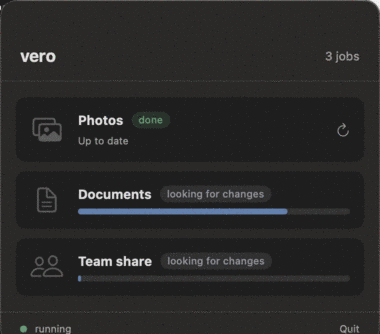
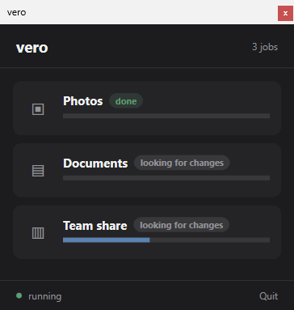
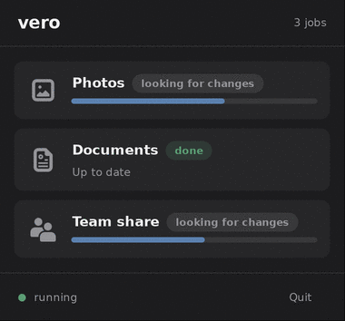

# The styling

The examples in this repository use stock controls, with no styling.

They were styled before. This page keeps both versions and the code that made
the difference.

## Before and after

<table>
<tr>
<td align="center" width="33%"><br><sub><b>macOS</b> — stock</sub></td>
<td align="center" width="33%"><br><sub><b>Windows</b> — stock</sub></td>
<td align="center" width="33%"><br><sub><b>Linux</b> — stock</sub></td>
</tr>
<tr>
<td align="center"><br><sub>styled</sub></td>
<td align="center"><br><sub>styled</sub></td>
<td align="center"><br><sub>styled</sub></td>
</tr>
</table>

Same widgets, same worker, same behaviour in both rows. Nothing below changes a
single call into vero.

## Linux — 51 lines of CSS

```python
CSS = b"""
window { background: #1c1c1e; }
.title { font-size: 19px; font-weight: bold; color: #f2f2f2; }
.count, .state { color: #949499; font-size: 12px; }
.card { background: #262628; border-radius: 10px; padding: 14px; }
.job { font-size: 15px; font-weight: bold; color: #f2f2f2; }
.sub { font-size: 12px; color: #949499; }
.icon { color: #949499; }
button.icon-button {
    background: none;
    background-image: none;
    border: none;
    box-shadow: none;
    padding: 4px;
    min-width: 0;
    min-height: 0;
}
button.icon-button:hover {
    background-color: alpha(#ffffff, 0.07);
    border-radius: 8px;
}
.badge {
    font-size: 11px;
    font-weight: bold;
    padding: 4px 10px;
    border-radius: 11px;
    background: alpha(#949499, 0.16);
    color: #949499;
}
.badge.done   { background: alpha(#5c9e75, 0.16); color: #5c9e75; }
.badge.upload { background: alpha(#5c82b0, 0.16); color: #5c82b0; }
.dot  { color: #5c9e75; font-size: 11px; }
.sep  { background: #333335; min-height: 1px; }
/* GTK4 nests these, and the theme paints the fill with a background-image
   gradient - so the shorthand alone leaves it looking empty. Both have to be
   set, and the image cleared. */
progressbar > trough {
    min-height: 6px;
    background-color: #38383a;
    background-image: none;
    border: none;
    border-radius: 3px;
}
progressbar > trough > progress {
    min-height: 6px;
    background-color: #5c82b0;
    background-image: none;
    border: none;
    border-radius: 3px;
}
button.flat { background: none; border: none; color: #949499; font-size: 12px; }
"""
```

Applied once, in the window's initialiser:

```python
provider = Gtk.CssProvider()
provider.load_from_data(CSS)
Gtk.StyleContext.add_provider_for_display(
    self.get_display(), provider, Gtk.STYLE_PROVIDER_PRIORITY_APPLICATION)
```

and then `add_css_class("card")`, `("badge")`, `("icon-button")` and so on where
each widget is built.

## Windows — 42 lines of resources

```xml
<Window.Resources>
        <SolidColorBrush x:Key="Text"    Color="#F2F2F2"/>
        <SolidColorBrush x:Key="Muted"   Color="#949499"/>
        <SolidColorBrush x:Key="Card"    Color="#262628"/>
        <SolidColorBrush x:Key="Line"    Color="#333335"/>
        <SolidColorBrush x:Key="Active"  Color="#5C82B0"/>
        <SolidColorBrush x:Key="Done"    Color="#5C9E75"/>

        <!-- A real button, drawn flat. Hover, focus and the keyboard come from
             WPF; only the chrome is ours. -->
        <Style x:Key="IconButton" TargetType="Button">
            <Setter Property="Background" Value="Transparent"/>
            <Setter Property="BorderThickness" Value="0"/>
            <Setter Property="Cursor" Value="Hand"/>
            <Setter Property="Padding" Value="6"/>
            <Setter Property="Template">
                <Setter.Value>
                    <ControlTemplate TargetType="Button">
                        <Border x:Name="Chrome" CornerRadius="8"
                                Background="{TemplateBinding Background}"
                                Padding="{TemplateBinding Padding}">
                            <ContentPresenter HorizontalAlignment="Center"
                                              VerticalAlignment="Center"/>
                        </Border>
                        <ControlTemplate.Triggers>
                            <Trigger Property="IsMouseOver" Value="True">
                                <Setter TargetName="Chrome" Property="Background" Value="#22FFFFFF"/>
                            </Trigger>
                            <Trigger Property="IsKeyboardFocused" Value="True">
                                <Setter TargetName="Chrome" Property="Background" Value="#22FFFFFF"/>
                            </Trigger>
                        </ControlTemplate.Triggers>
                    </ControlTemplate>
                </Setter.Value>
            </Setter>
        </Style>

        <Style x:Key="Badge" TargetType="Border">
            <Setter Property="CornerRadius" Value="10"/>
            <Setter Property="Padding" Value="8,2"/>
            <Setter Property="VerticalAlignment" Value="Center"/>
        </Style>
    </Window.Resources>
```

The rows then reference them: `Style="{StaticResource IconButton}"`,
`Background="{StaticResource Card}"`, and a `Badge` border around the phase.

## macOS — 50 lines of controls

SwiftUI has no stylesheet, so the styling is two replacement controls plus card
modifiers on the row.

```swift
struct ProgressBar: View {
    let fraction: Double

    var body: some View {
        GeometryReader { geo in
            ZStack(alignment: .leading) {
                Capsule().fill(Color.primary.opacity(0.12))
                Capsule().fill(Palette.active)
                    .frame(width: max(3, geo.size.width * min(1, max(0, fraction))))
            }
        }
        .frame(height: 6)
    }
}

/// The phase, as a word rather than a number: "uploading" says more about what
/// is happening than 62% does.
///
/// Colour carries meaning here rather than decorating. Ordinary progress is
/// neutral - "looking for changes" is not a warning and should not look like
/// one - and only finishing earns a colour. Reserving amber and red for things
/// that are actually wrong is what makes them worth noticing.
struct PhaseBadge: View {
    let phase: String

    var body: some View {
        Text(phase)
            .font(.caption2).fontWeight(.medium)
            .padding(.horizontal, 7)
            .padding(.vertical, 2)
            .background(Capsule().fill(colour.opacity(0.16)))
            .foregroundStyle(colour)
    }

    private var colour: Color {
        switch phase {
        case "done":      return Palette.done
        case "uploading": return Palette.active
        default:          return Palette.neutral
        }
    }
}

/// Muted on purpose. Saturated blue against saturated amber, on every row, is
/// loud enough to be tiring in something that sits in the menu bar all day.
enum Palette {
    static let neutral = Color(red: 0.58, green: 0.58, blue: 0.61)
    static let active  = Color(red: 0.36, green: 0.51, blue: 0.69)
    static let done    = Color(red: 0.36, green: 0.62, blue: 0.46)
    static let warn    = Color(red: 0.76, green: 0.55, blue: 0.29)
}
```
